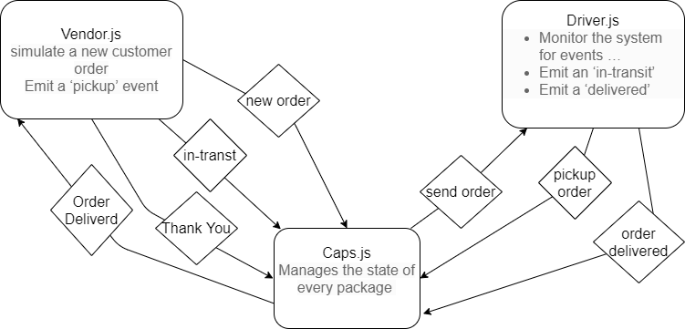

# caps

The first phase, our goal is to setup a system of events and handlers, with the intent being to change out the eventing system as we go, but keeping the handlers themselves largely the same. The task of “delivering a package” doesn’t change (the handler), even if the mechanism for triggering that task (the event) does.

# Install
* Clone the repository from GitHub
* Run the command npm i dotenv faker jest to install dependencies
* create .env file with STORE variable with the store name

# Test
Run the command npm test to test and verify the events are being called.

# Run
Run the command nodemon to see the events in action

Links : 

[RepoLink](https://github.com/yasmeenokh/caps)

[ActionsLink](https://github.com/yasmeenokh/caps/actions)

[PullRequests](https://github.com/yasmeenokh/caps/pulls)

# Results 

# UML 

